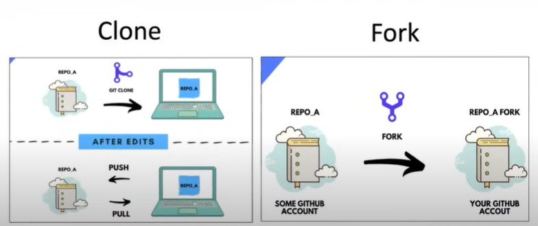

# 00_Tools.
>> GitHub.(Cloud/Server-side)

>> Fork.(Desktop/OS/Local/Client-side)

- - -
- - - 
- - -

# 01_Local.
> Computer/Desktop\
> Data move from (fork to github)

***
***
***

# 02_Remote.
> GitHub/CLouds\
> Data fetch from (github to fork)

---
---
---

# 03_pull & push.
>>> Data pull/fetch from github to fork !

>> Data push/move to github from fork !

***
***
***

# 04_commit
>> Commit OR Saved our data in terms of (Remotely / Localy) !

***
***
***

# 05_branch
> Branches could be different: 
- >> For Personal, use to build our projects...
- >> For Teacher, use to for (FYP) to show our projects with our Supervsor...

***
***
***

# 06_git-ignore.
> Those files which are not use !\
> OR
> Like, images, videos that not want to push in my github...\
>>> So, ignore those files

***
***
***

# 07_Merge/Git-Conflict.
> When we change specfic file on GITHUB. But at same thing occurs from other side, anyone who access the same file and changes it on same line of code,\
> Thats point is,\
>>> **(Merge OR Git) Conflict Occure** !

***
---
***

# 08_Cloning.
> Cloning is that, import the files or full folder of those who gives the link of his Repositery to you\
> **import files** 

***
***
*** 

# 09_Forking.
> Forking is that, I could be import any Repositery which is public, to our GitHub-Account-(ID)...\
> Which Benefit is that any changes occure from other side will notify me.

***
***
*** 

# 10_Clone VS Fork

***
***
*** 

# 11_Contents:
> [Tools](#00_tools)

> [Local](#01_local)

> [Remote](#02_remote)

> [pull & push](#03_pull--push)

> [commit](#04_commit)

> [branch](#05_branch)

> [git-ignore](#06_git-ignore)

> [Merge/Git-Conflict](#07_mergegit-conflict)

> [Cloning](#08_cloning)

> [Forking](#09_forking)

> [Clone VS Fork](#10_clone-vs-fork)

---
>>>>>>>>>># THE END