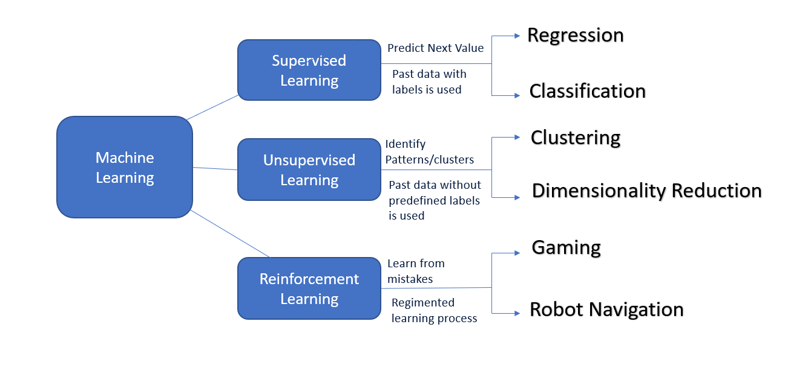

# **Machine Learning**
In Machine learning, machine can learn from the data provided or their own experience. It depends upon the type of machine learning.

## *Types* of **(Machine Learning)**
### - Supervised ML 
### - Un-Supervised ML
### - Semi-Supervised ML
### - Re-inforcement ML
***
## Models.

***

> ## **Supervised Machine Learning**
> Types:
> - Classification. (For Catagories)
> - Regression. (For Numeric)
>## **Supervised Learning Alogorithms:**
>>## Logistic Reggression
>> [Logistic Reggression](https://www.javatpoint.com/logistic-regression-in-machine-learning) 
>
>> ## K-Neearest Neighbours. (KNN)
>> [KNN](https://www.javatpoint.com/k-nearest-neighbor-algorithm-for-machine-learning) 
>
>> ## Support Vector Machine.(SVM)
>> [Support Vector Machine](https://www.javatpoint.com/machine-learning-support-vector-machine-algorithm)
> 
>> ## Kernal.(SVM)
>> [Kernal.(SVM)](https://www.javatpoint.com/what-is-kernel)
>
>> ## Naive Bays
>> [Naive Bays](https://www.javatpoint.com/machine-learning-naive-bayes-classifier)
> 
>> ## Gaussian Naive Bays
> 
>> ## Decision Tree.(Classification)
>> [Decision Tree](https://www.javatpoint.com/machine-learning-decision-tree-classification-algorithm)
>
>> ## Random Forest.(Classification)
>> [Random Forest](https://www.javatpoint.com/machine-learning-random-forest-algorithm)
>

